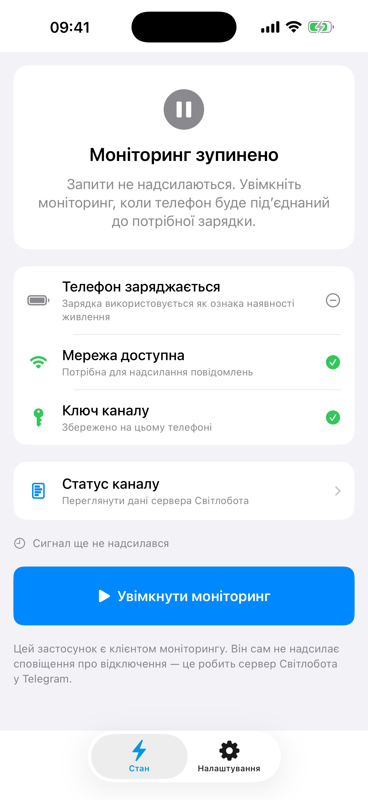
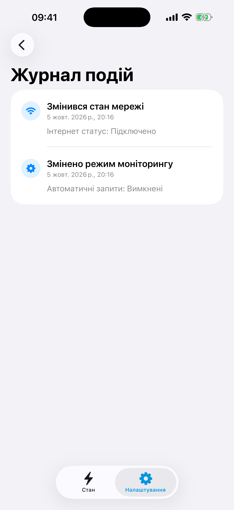
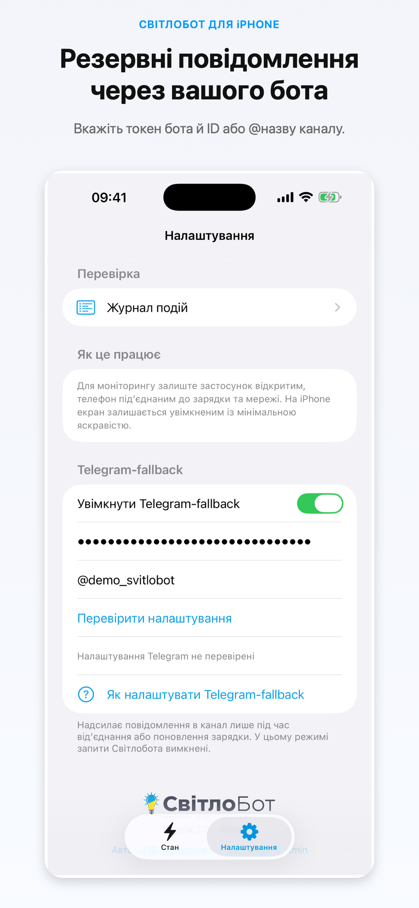

# СвітлоБот для iOS

**СвітлоБот** перетворює iPhone або iPad на простий монітор наявності електроенергії. Застосунок стежить за заряджанням пристрою та надсилає вибраній системі сповіщень сигнал про його стан.

За звичайного використання застосунок звертається до сервера [Світлобота](https://svitlobot.in.ua). Сервер визначає зміну статусу та публікує повідомлення в Telegram-каналі. **Застосунок не публікує такі повідомлення в канал самостійно**, доки ви окремо не ввімкнете Telegram-fallback.

[Інструкція до застосунку](https://baskerville42.github.io/SvitloBotIOS/) · [Політика приватності](https://baskerville42.github.io/SvitloBotIOS/privacy-policy.html) · [Умови використання](https://baskerville42.github.io/SvitloBotIOS/terms-of-use.html) · [Повідомити про вразливість](SECURITY.md)

[](https://github.com/Baskerville42/SvitloBotIOS/actions/workflows/codeql.yml) [](https://www.bestpractices.dev/projects/15272) [](https://github.com/Baskerville42/SvitloBotIOS/actions/workflows/pages.yml)


## Можливості

- Відстеження стану заряджання та автоматичні сигнали серверу Світлобота.
- Необов’язковий миттєвий сигнал після від’єднання зарядного пристрою.
- Окремий Telegram-fallback, який надсилає повідомлення безпосередньо через вашого Telegram-бота.
- Черга Telegram-повідомлень, які не вдалося надіслати через відсутність інтернету.
- Журнал подій, статус каналу та команди для застосунку «Швидкі команди».
- Підтримка iPhone та iPad; мінімальна версія iOS/iPadOS — 14.0.

## Як це працює

Застосунок використовує факт заряджання пристрою як непрямий сигнал про наявність електроенергії. Щоб регулярно надсилати сигнали з інтервалом близько хвилини, залишайте його відкритим на екрані. iOS обмежує фонову роботу, а показник заряджання не є вимірюванням електромережі.

### Режим Світлобота

1. Введіть ключ каналу в застосунку — під час першого запуску або в налаштуваннях.
2. Увімкніть автоматичний моніторинг і під’єднайте пристрій до зарядного пристрою.
3. За потреби увімкніть миттєвий сигнал про припинення заряджання.
4. Переглядайте відповіді серверу та журнал подій у застосунку.

За наявності інтернету перший сигнал надсилається одразу, наступні — приблизно раз на 60 секунд. Сервер Світлобота відповідає за визначення статусу та публікацію в Telegram.

### Telegram-fallback

Цей режим працює **замість** режиму Світлобота. Застосунок надсилає Telegram Bot API повідомлення під час від’єднання й поновлення заряджання.

1. Створіть бота через [@BotFather](https://t.me/BotFather).
2. Додайте його до потрібного каналу з правом публікувати повідомлення.
3. Увімкніть Telegram-fallback у налаштуваннях і введіть токен бота та ідентифікатор каналу або його `@username`.
4. Перевірте налаштування й підтвердьте ввімкнення режиму.

Токен Telegram зберігається у Keychain на пристрої. Не публікуйте його, ключ каналу чи приватний ідентифікатор каналу у звітах, скриншотах або комітах. Докладніше про обробку даних — у [політиці приватності](https://baskerville42.github.io/SvitloBotIOS/privacy-policy.html).

## Скріншоти

| Огляд моніторингу | Журнал подій | Telegram-fallback |
|:--:|:--:|:--:|
|  |  |  |

## Вимоги

- Xcode із підтримкою iOS 14 SDK або новішої версії.
- iOS/iPadOS 14.0 або новіша версія на пристрої.
- Для режиму Світлобота: ключ каналу, інтернет і під’єднаний зарядний пристрій.
- Для Telegram-fallback: Telegram-бот і канал, де він може публікувати повідомлення.

## Локальна розробка

```bash
git clone https://github.com/Baskerville42/SvitloBotIOS.git
cd SvitloBotIOS
open SvitloBot.xcodeproj
```

Виберіть схему `SvitloBot` та симулятор або під’єднаний пристрій. Підписання й поширення застосунку залишаються в Xcode Cloud. GitHub Actions використовуються для аналізу коду, оновлення workflow-залежностей і публікації сайту документації.

Для перевірок без Xcode Cloud дивіться [CONTRIBUTING.md](CONTRIBUTING.md), [опис моделі загроз](THREAT_MODEL.md) та [план захисту налаштувань репозиторію](docs/REPOSITORY_SECURITY.md).

## Приватність і безпека

Застосунок зберігає Telegram-токен у Keychain і не має облікових записів користувачів. Увімкнені мережеві режими передають дані серверам Світлобота або Telegram відповідно до вибраного режиму. Повний перелік даних і одержувачів наведений у [політиці приватності](docs/privacy-policy.html).

Повідомляйте про вразливості приватно згідно з [SECURITY.md](SECURITY.md). Не створюйте публічне issue з токенами, ключами каналів або даними користувачів.

## Ліцензія

Код поширюється за ліцензією [MIT](LICENSE). Назви й торговельні марки Apple та Telegram належать відповідним правовласникам; цей проєкт не афілійований з Apple Inc. або Telegram.
